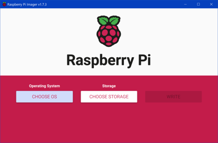
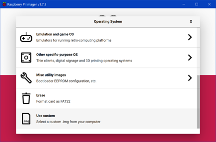
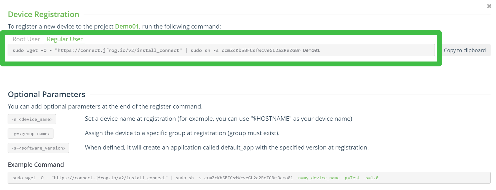
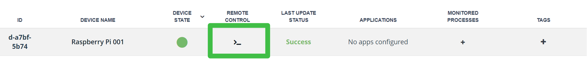
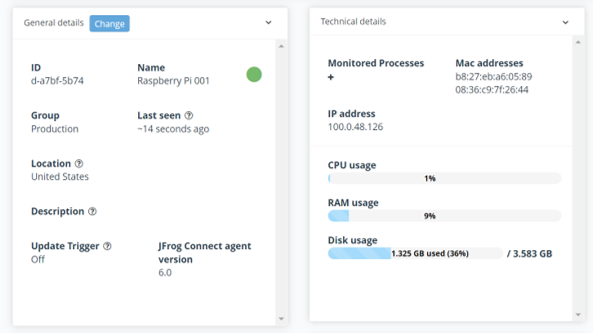

# Readying a Raspberry Pi #

## Before You Begin ##

### About This Lab ###
Setup a Raspberry Pi (RPi) and register it in Connect by downloading the Connect Agent. The agent is 4MB large and requires 11MB of RAM. It requires nothing but the essentials of Linux -- meaning there is no depenency on things like Docker, Java, etc...

### About JFrog Connect ###
JFrog Connect is a modern Linux-first IoT platform designed to efficiently monitor, manage and update edge and IoT devices at scale. This is performed over a network connection, also known as over the air (OTA).
Use-cases include manufacturing, automotive, security cameras, kiosks, and robots.

### Required Hardware ###
1. Raspberry Pi
2. Power adapter
3. SD Card
4. HDMI Cable
5. Monitor
6. USB keyboard
7. Wifi adapter or ethernet connection (for older RPi models)
    

Our setup includes a Raspberry Pi 1 Model B, 4GB SD card, and NetGear wifi adapter A6150. Older RPi models like this don’t include built-in wifi support.


## Lab Instructions ##
### Flash a Linux Image ###
1. Download and run the  
[Raspberry Pi Imager](https://www.raspberrypi.com/software/
).
2. Choose a Raspberry Pi OS. These are all Debian Linux variants. Your choice will depend on your SD card size and Raspberry Pi model:
	- For smaller SD cards, choose options with 	no desktop environment
	- For older RPi models with no built-in wifi,	choose an older OS. These are more likely to have available wifi adapter drivers. 
	- We chose **Use custom** and downloaded the 
    [2020-05-28 Debian Buster image](
    https://downloads.raspberrypi.org/raspios_lite_armhf/images/).
3. Choose the SD card and write the image.

    
    

### Power On ###
4. Insert the SD card in the RPi.
5. Power on the RPi.
6. Login. For older OS images, the default	login may be:
	- **Username:** pi
	- **Password:** raspberry

### Ready the Wifi ###
Skip Step 7 if you don’t need to find a wifi adapter driver.

7. Install the wifi adapter driver (this assumes you have a wired connection):
	- MrEngman, from the Raspberry Pi forum, wrote an [excellent tool](
    https://forums.raspberrypi.com/viewtopic.php?t=241593) to retrieve the correct driver.	
	- In the terminal, enter the following:
        ````
        sudo wget http://downloads.fars-robotics.net/wifi-drivers/install-wifi -O /usr/bin/install-wifi
        sudo chmod +x /usr/bin/install-wifi
        sudo install-wifi
        ````
    - If a driver isn’t found, you may need to use a different wifi adapter or OS version. Or find a driver manually. 
    - If you've found a driver, remove the wired connection. 
8. Enter ````sudo raspi-config````
	- In **Localisation Options**, set the WLAN Country.
	- In **Network Options**, set the SSID and passphrase for your network.

### Download the Connect Agent ###
9. Log in to your JFrog Connect account or choose **Start for Free**: https://jfrog.com/connect/
10. Once you’re logged in, select **Start with your device now** and name your project
11. Select **Register Device**
12. Enter, into the RPi terminal, either of the two statements shown. The RPi should be connected in a matter of seconds.
    

### Test the Connection ###
13. *(Optional)* Click the button for remote control access to the device. Within a few seconds, a reverse SSH tunnel is created. Click **Connect**.
    
14. *(Optional)* Enter ````sudo reboot now```` in the remote terminal. The actual RPi will reboot, and the remote terminal should close automatically. Rebooting the RPi isn’t necessary. It’s just an obvious action you can use to prove the connection works.
15. Scroll down in Connect. You should find modifiable general details about the device, as well as see technical details.
    

## Next Lab ##
Move on to the next lab [Push Files to a Device, Compile, and Run](/Initial-files.md).