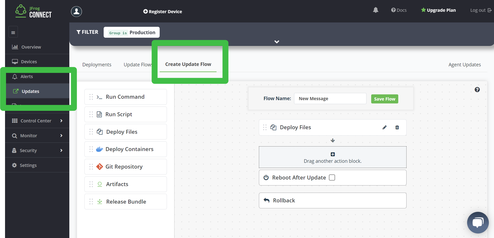

# Update a Device While its Program Runs #

## Before You Begin ##

### About This Lab ###
You'll create another update flow that updates a device while it runs. It's recommended that you get binaries you need working on one device before rolling out updates to the entire fleet. In the field, you may also need to reboot the devices as part of the update. Whenever you specify files as part of an update flow, they are automatically stored on you JFrog platform/Artifactory instance.

### About JFrog Connect ###
JFrog Connect is a modern Linux-first IoT platform designed to efficiently monitor, manage and update edge and IoT devices at scale. This is performed over a network connection, also known as over the air (OTA).
Use-cases include manufacturing, automotive, security cameras, kiosks, and robots.

### Requirments ###
- Have in instance of JFrog Connect.
- Have a Raspberry Pi (RPi) or virtual device registered in Connect.
- Have downloaded and deployed the initial files as part of the previous lab.

## Lab Instructions ##
### Update the Message ###
1. Ensure the program is still running on the RPi
    - Ignore this if you don't have a RPi.
2. Modify `message.txt` to read `Fixed` instead of `Buggy`.
3. Navigate to **Updates** > **Create Update Flow**. 
4. Name the flow `New Message`
5. Drag the **Deploy Files** block into the flow and click the **pencil** icon to edit the block
	- **Destination**: `/home/pi`
	- Specify the updated `message.txt`
6. Click **Save Flow**.
7. When asked about the General Rollback, select **Continue Anyway**.
    

### Deploy the Update Flow ###
8. Navigate to **Updates** > **Update Flows**. 
9. Click the **New Deployment cloud icon** for the `New Message` update.
10. Click the **Select Devices** button.
	- Filter for, and select your specific device.
	- Select **Apply**, **Next**, **Finish**.
11. In this case, unselect **Set app version**.
12. Click **Create Deployment** and run the deployment.
13. Observe the new message in the running program!
	 - If you don’t have a RPi, open a remote 	terminal and observe the new output when you run `./demo` again. **Remember to do this as the `pi` user**!

## Next Lab ##
Congratulations, you've finished all the Connect 101 labs!